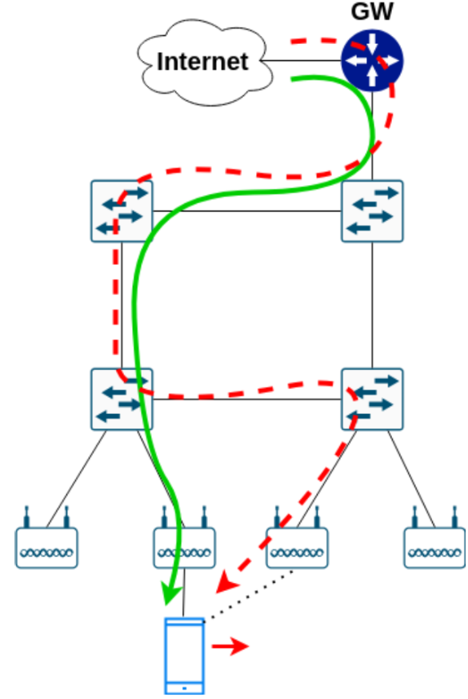

# Software Defined Networking (SDN) with POX Controller
The scenario considered in this project is that of a mobile network.
The network infrastructure consists of two main sections:
+ the fronthaul, which provides access to end users;
+ the backhaul, which interconnects the access section with external networks (e.g., the Internet).
  
Control functions are managed by an SDN controller, which provides services such as:

+ host tracking, an application that constantly monitors the user's location, understood as the access node used to connect to the infrastructure;
+ topology discovery, a function that determines the network topology;
+ user mobility, an application that manages traffic flow routing, handling path modifications when a user moves;
+ fake gateway, a responder to ARP requests addressed to the gateway.



With reference to the user mobility application, an example of its operation is shown in the figure. In particular, the green line represents the currently used path to send data to the user. Subsequently, the User Equipment changes access point, causing traffic to be rerouted along the new path (determined by the user mobility app). This path is chosen to minimize the number of devices to be reconfigured, thus reducing handover time. An example is depicted in the figure as a dashed red line.


# How to run the applications
With python3.9:
```bash
python3.9 ./pox.py <application_1> ... <application_n>
```
Usual:
```bash
./pox/pox.py discovery_channel user_mobility fake_gateway host_tracking
```
Remember pox will be in ./pox. 
After loading the controller wait a bit for the links to be discovered! After they are discovered (the controller will send some messages like "added link si-sj, ports ..."), you can start pinging the internet module from the host using the interfaces with
```bash
 ping -I eth0/1/2/3 100.0.0.1
```
and you should see the user_mobility and host_tracking modules in action, while fake_gateway will provide the necessary layer 2 support underneath. 
IMPORTANT: whenever there is a change in flow, look for "Event raised by" messages in the controller terminal, from there until the end of the log you can read how the whole event is handled. The host tracker
will tell where the host is using "Host is connected to..." messages.

