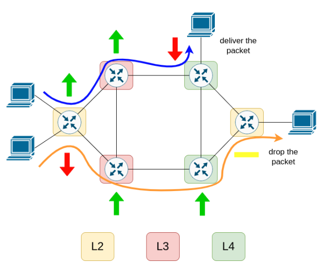

# Distributed Consensus Protocol in P4

In this project, we used the P4 language to define a distributed consensus service. Specifically, during the transit of a packet within the network domain, each intermediate node expresses its opinion regarding the treatment that the packet should undergo (allowed, to drop, abstained). This decision is made by each node by observing certain specific fields of the packet itself. Each network node is specialized in a specific layer of the stack. Upon reaching the egress node, if the absolute majority of nodes have voted for the "allowed" option, then the packet is delivered to the recipient; otherwise, it is discarded. 

Based on the topology and rules we have implemented, we have the following switches behaviours.

## SWITCH S1:

Allow:
- IPv6 traffic between h1 and h4 (in both directions)
- IPv6 traffic between h2 and h4 (in both directions)
- IPv4 and IPv6 traffic from h1 to h2 (but not vice versa)

Deny:
- IPv4 and IPv6 traffic between h1 and h3 (in both directions)
- IPv4 traffic between h2 and h4 (in both directions)

## SWITCH S2:

Allow:
- IPv6 traffic from h3
- IPv6 traffic from h4

Deny:
- IPv4 traffic from h3
- IPv4 traffic from h4

## SWITCH S3:

Allow:
- IPv4 and IPv6 traffic from h1
- IPv4 and IPv6 traffic from h2
- IPv4 and IPv6 traffic from h4

Deny:
- Nothing

## SWITCH S4:

Allow:
- Traffic on TCP port 1122
- Traffic on UDP port 4455

Deny:
- Nothing

## SWITCH S5:

Allow:
- Traffic on TCP port 120

Deny:
- Nothing

## SWITCH S6:

Allow:
- IPv4 and IPv6 traffic between h4 and h1 (in both directions)
- IPv4 and IPv6 traffic between h4 and h2 (in both directions)
- IPv6 traffic from h4 to h3 (only in this direction)

Deny:
- Nothing

## Examples:

- h4 executes: `ping4 192.168.0.1`
	- s6: allow
	- s4: irrelevant (L4)
	- s2: abstain -> deny
	- s1: abstain -> deny\
	The packet is therefore discarded.

- h4 executes: `ping6 2001::1`
	- s6: allow
	- s4: irrelevant (L4)
	- s2: allow
	- s1: allow\
	The packet reaches h1, but can h1 respond?
	- s1: allow
	- s2: abstain -> deny
	- s4: irrelevant (L4)
	- s6: allow\
	The response therefore reaches h1.

- h4 executes: `nc -p <not 1122> 192.168.0.1 <not 1122>`
  h1 executes: `nc -lvp <not 1122>`
	- s6: allow
	- s4: deny
	- s2: deny
	- s1: deny\
	The packet is therefore discarded.

- h4 executes: `nc -p 1122 192.168.0.1 1122`
  h1 executes: `nc -lvp 1122`
	- s6: allow
	- s4: allow
	- s2: deny
	- s1: deny\
	The packet is therefore discarded.

- h4 executes: `nc -p 1122 2001::1 1122`
  h1 executes: `nc -6 -l -v -p 1122`
	- s6: allow
	- s4: allow
	- s2: allow
	- s1: allow\
	Response:
	- s1: allow
	- s2: allow
	- s4: deny
	- s6: allow\
	Communication is therefore possible.

- h4 executes: `ping4 192.168.0.2`
	- s6: allow
	- s5: irrelevant (L4)
	- s3: allow
	- s1: deny\
	Response:
	- s1: deny
	- s3: allow
	- s5: irrelevant (L4)
	- s6: allow\
	Communication is therefore possible.

- h1 executes: `ping4 192.168.0.2`
	- s1: allow\
	Response:
	- s1: deny\
	The packet is therefore discarded.
